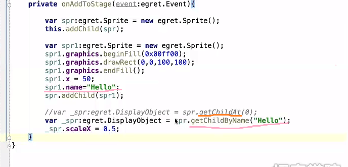

### 1.深度值，层级
addChild,addChildAt,swapChildren,swapChildrenAt,setChildIndex使用方法如下图：

### 2.访问容器子对象的两种方法
2.1 通过子对象的深度值getChildAt(number)。该方法必须要知道深度值number。
2.2 通过子对象的name属性getChildByName(name)。该子对象一定要有name属性。

### 3.添加与删除显示对象
3.1 addChild只是显示对象，把一个存在的对象添加到页面（容器/舞台）中。
3.2 removeChild只是将一个对象移除显示页面（容器/舞台），删除后该对象依然存在。

