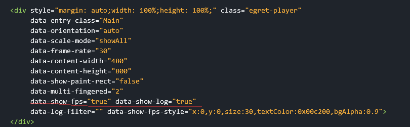
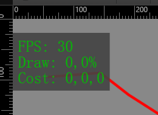

#性能面板
### 1. 开启性能面板

### 2. 性能面板各参数

+ 2.1 fps 帧率

+ 2.2 draw 画的数量，画的区域的百分比

+ 2.3 cost 计算脏矩形开销 draw开销

#### 参考资料：
> 1. http://bbs.egret.com/forum.php?mod=viewthread&tid=13876&highlight=%E6%80%A7%E8%83%BD%E9%9D%A2%E6%9D%BF
