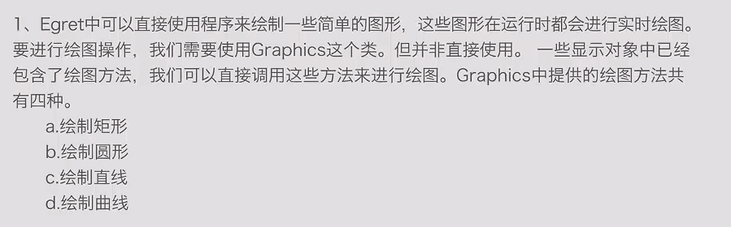

# 矢量绘图
### 1.Egret矢量绘图的四种方法汇总


### 1.1. 直线
```
private drawLine(): void {
    var shp: egret.Shape = new egret.Shape();
    shp.graphics.lineStyle(5,0xff0000);
    shp.graphics.moveTo(68,84);
    shp.graphics.lineTo(167,76);
    shp.graphics.lineTo(221,118);
    shp.graphics.lineTo(290,162);
    shp.graphics.lineTo(297,228);
    shp.graphics.lineTo(412,250);
    shp.graphics.lineTo(443,174);
    shp.graphics.endFill();
    this.addChild(shp);
}
```    
### 1.2. 曲线
```
private drawCurve(): void {
    var shp: egret.Shape = new egret.Shape();
    shp.graphics.lineStyle(5,0xff0000);
    shp.graphics.moveTo(10,210);
    shp.graphics.curveTo(100,300,200,250);
    shp.graphics.endFill();
    this.addChild(shp);
}
```
### 1.3. 矩形
```
private drawRect(): void {
    var shp: egret.Shape = new egret.Shape();
    shp.graphics.beginFill(0xff0000,1);
    shp.graphics.drawRect(100,500,100,100);
    shp.graphics.endFill();
    this.addChild(shp);
}
```
### 1.4. 圆
```
private drawCircle(): void {
    var shp: egret.Shape = new egret.Shape();
    shp.graphics.beginFill(0xff0000,1);
    //shp.graphics.lineStyle(10,0x0000ff);
    shp.graphics.drawCircle(100,400,50);
    shp.graphics.endFill();
    this.addChild(shp);
}
```
