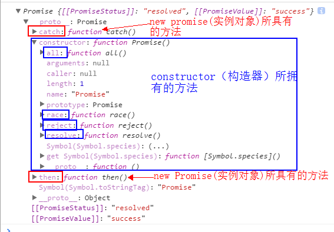

promise语法学习
=====

******

##1、回调灾难
我们选择回调中一个重要的场景，ajax请求。通常，由于网络环境不同，我们ajax拿到的结果所需时间也不同。
因此，我们需要等待结果出来之后才能进行对结果进行操作。
如果此时我们要对从上一次ajax的返回参数中在进行一个ajax请求，这样我们就得这样做：

栗子：

    `var url1=http://url1;
     var result1;
     
     var XHR1=new XmlHttpRequest();
     XHR1.open('GET',url1);
     XHR1.send();
     
     XHR1.onreadystatechange=function(){
        if(XHR1.readstate==4 && XHR1.status==200){
            result1=XHR1.response;
            // other code....
            
            //下一个嵌套ajax请求
            var ur2=http://url2;
            var result2;
           
            var XHR2=new XmlHttpRequest();
            XHR2.open('GET',url2);
            XHR2.send();
            XHR1.onreadystatechange=function(){
                    //coding here...            
            }
        }
     }`

当出现第三个ajax（甚至更多）依赖上一个请求的时候，我们的code就是一团乱了，这个也叫做回调灾难。因此我们需要一个叫做
Promise的东西来解决这个问题。让我们的代码更具可读性和维护性。

##2、简单的回调函数或者函数栈的封装
我们可以简单利用回调函数进行封装
    
     function want(){
        console.log('执行函数');
     }
     function fn(f){
        console.log('执行了许多许多的代码！！！');
        f && f();
     }
     fn(want);

如果了解函数调用栈的执行顺序，我们可以用JS的队列机制
    
    function want(){
       console.log('执行函数');
    }
    function fn(f){
       console.log('执行了许多许多的代码！！！');
       f && setTimeout(fn,0);
    }
    fn(want);
   
##3、简介Promise对象
###Promise 对象有以下两个特点。

    1.对象的状态不受外界影响。Promise 对象代表一个异步操作，有三种状态：Pending（进行中）、Resolved（已完成，又称 Fulfilled）和 Rejected（已失败）。
      只有异步操作的结果，可以决定当前是哪一种状态，任何其他操作都无法改变这个状态。
    2.一旦状态改变，就不会再变，任何时候都可以得到这个结果。Promise 对象的状态改变，
      只有两种可能：从 Pending 变为 Resolved 和从 Pending 变为 Rejected。只要这两种情况发生，状态就凝固了，不会再变了，会一直保持这个结果。
      就算改变已经发生了，你再对 Promise 对象添加回调函数，也会立即得到这个结果。这与事件（Event）完全不同，事件的特点是，如果你错过了它，再去监听，是得不到结果的。
  有了 Promise 对象，就可以将异步操作以同步操作的流程表达出来，避免了层层嵌套的回调函数。
此外，Promise 对象提供统一的接口，使得控制异步操作更加容易。 
  Promise 也有一些缺点。   
首先，无法取消 Promise，一旦新建它就会立即执行，无法中途取消。
其次，如果不设置回调函数，Promise 内部抛出的错误，不会反应到外部。
第三，当处于 Pending 状态时，无法得知目前进展到哪一个阶段（刚刚开始还是即将完成）。
    
    var Promise=new Promise(function(resolve,reject){
        if(/*true*/){
            resolve(value)
        }else{
            reject(error)
        }
    });
    
    Promise.then(function(value){
        //success
    },function(err){
        //fail    
    })

###Promise的基本API

* Promsie.resolve()   
            
        //使用静态的Promsie.resolve   
          Promise.resolve('success').then(function(value){
            //success 
            //处理value 
            console.log(value);
          },function(){
            //fail 
            //不会执行
          })
       
* Promsie.reject()   
         
         //使用静态的Promsie.reject   
          Promise.reject('err').then(function(value){
            //success
            //不会执行
          },function(err){
             //fail   
             //处理 err
              console.log(err);
          })  

* Promsie.prototype.then()   
   
###then方法讲解,Promise对象中的then方法，可以接收构造函数中处理的状态变化，并分别对应执行。then方法有2个参数，第一个函数接收resolved状态的执行，第二个参数接收reject状态的执行。   
        var promise=new promise() //new一个promise     `      
        console.log(promise)`   
     
        
栗子：   
        
        var promise=new Promise(resolve,reject){
            if(true){
                resolve('success');
            }else{
                reject('err')
            }
        }
        promise.then(function(value){
            //resolve 状态的方法
            console.log(value);
        },function(err){
            //reject 状态的方法
            console.log(err)
        })
###promises 的奇妙在于给予我们以前的 return 与 throw
###我们可以借此做三件事
            1. return 另一个Promise
            2. return 一个同步的值(或者undefined)
            3. throw 一个异常 `throw new Error('...')`   

栗子：   
        
        function fn(num) {
            var p2=new Promise(function (resolve, reject) {
                if (typeof num == 'number') {
                    resolve('success');
                } else {
                     reject('fail');
                }
            }).then(function (value) {
                 console.log('参数是一个number值',value);
                 return new Promise(
                    function(resolve,reject){
                         if(false){
                             resolve('then2 success')
                         }else{
                             reject('then2 fail')
                         }
                    })}, function (err) {
                         console.log('参数不是一个number值',err);
                         return 'this is promise2'
                    }
            ).then(function(value){
                   console.log('1=>',value);
                   },function(err){
                    console.log('2=>',err);
            });
            return p2;
        }
        fn(1234);
     
 栗子：
           
           function fun(num){
               return new Promise(function(resolve,reject){
                   if(typeof num=='number'){
                       resolve('this is a number');
                   }else{
                       reject('this is not a number');
                   }
               }).then(function(value){
                           console.log('resolve',value);
                           return ++num;
                       },function(err){
                           console.log('reject',err);
                           return 'TypeError'
               }).then(function(value){
                           console.log(value);
                       })
           }
           fun('88888');
栗子：  
        
        function fun1(num){
            return new Promise(function(resolve,reject){
                if(typeof num=='number'){
                    resolve('this is a number');
                }else{
                    reject('this is not a number');
                    throw 'typeError'
                }
            }).catch(function(err){ //catch 只捕获一个错误，谁写在前面就捕获谁
                     console.log('catch',err);//'catch',this is not a munber
                    })
        }
        fun1('88888');
* Promsie.prototype.catch()
###每个Promise都会提供一个then()函数，和一个catch()函数【实际上就是then(null,function)函数】    
        function fun1(num){
            return new Promise(function(resolve,reject){
                if(typeof num=='number'){
                    resolve('this is a number');
                }else{
                    reject('this is not a number');
                    throw 'typeError'
                }
            }).catch(function(err){ //catch 只捕获一个错误，谁写在前面就捕获谁
                     console.log('catch',err);//'catch',this is not a munber
                    })
        }
        fun1('88888');
        /*other*/
        new Promise(function (resolve, reject) {
            throw new Error('悲剧了，又出 bug 了');
        }).catch(function(err){
            console.log(err);
        });

    

* Promsie.all()   
####当有一个ajax请求，它的参数需要另外2个甚至更多请求都有返回结果之后才能确定,那么这个时候，就需要用到Promise.all来帮助我们应对这个场景。 Promise.all接收一个Promise对象组成的数组作为参数，当这个数组所有的Promise对象状态都变成resolved或者rejected的时候，它才会去调用then方法。####
        var url1='http://url1',
            url2='http://url2';
        function renderAll(){
            return new Promise(getJSON(url1),getJSON(url2));
        }    
        renderAll().then(function(value){
            console.log(value)
        })

* Promsie.race()
####与Promise.all相似的是，Promise.race都是以一个Promise对象组成的数组作为参数，不同的是，只要当数组中的其中一个Promsie状态变成resolved或者rejected时，就可以调用.then方法了。而传递给then方法的值也会有所不同，大家可以再浏览器中运行下面的例子与上面的例子进行对比。
        function renderRace() {
            return Promise.race([getJSON(url), getJSON(url1)]);
        }
         
        renderRace().then(function(value) {
            console.log(value);
        })

