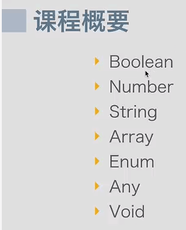
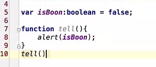
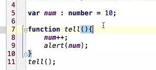
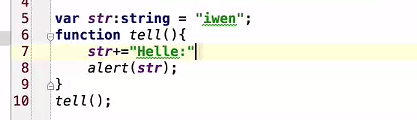

# typescript基本数据类型


### 1. boolean类型

```
let isDone: boolean = false;
```
### 2. number类型


```
let decimal: number = 6;
let hex: number = 0xf00d;
let binary: number = 0b1010;
let octal: number = 0o744;
```
### 3. string类型


```
let name: string = "bob";
name = "smith";
```


#### 参考资料：
> 1. http://www.jikexueyuan.com/course/281_1.html?ss=1
> 2. http://www.tslang.cn/docs/handbook/basic-types.html
> 3. http://www.typescriptlang.org/docs/handbook/basic-types.html

