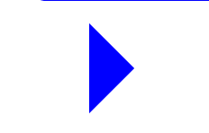

<h3>css的部分特效</h3>

<ul>
<li><strong>css的border属性绘制三角形</strong> 
先看一下border的默认绘制原理 宽高为0,border为100的正方形 
<pre>
.tra1{
    width: 0;
    height: 0;
    border-left: solid 100px #000;
    border-right: solid 100px gold;
    border-top: solid 100px bisque;
    border-bottom: solid 100px blue;
}
</pre>

</li>
<li><strong>绘制三角形</strong> 

两条边框有颜色

<pre>
.tra2{
     margin: 25px auto;
     width: 0;
     height: 0;
     border: solid 50px transparent;
     border-left-color: blue;
     border-bottom-color: blue;
}
</pre>

</li>
<li><strong>绘制三角形</strong> 
    
一条边框有颜色

    <pre>
    .tra2{
         margin: 25px auto;
         width: 0;
         height: 0;
         border: solid 50px transparent;
         border-left-color: blue;
    }
    </pre>
    
</li>
</ul>

<ul>
<li><strong>css的border-radius属性绘制圆角</strong> 

如果是有边框，绘制圆角时先从边框绘制

<pre>
    .tra2{
        width: 200px;
        height: 100px;
        border: solid 40px blue;
        border-radius: 40px/20px;
    }
</pre>

</li>
<li><strong>css的border-radius属性绘制圆角</strong> 
    
如果有边框，里边的content也需要圆角这么大，border-radius应该加倍

    <pre>
       .tra5{
           margin: 25px auto;
           width: 200px;
           height: 100px;
           border: solid 40px blue;
           border-radius: 80px 40px;
       }
    </pre>
    
</li>
<li><strong>css的border-radius属性绘制</strong> 
<pre>
    .tra5{
        width: 200px;
        height: 40px;
        border: solid 40px transparent;
        border-left-color: #000;
        border-bottom:solid 0  #000;
        border-radius: 0 0 0 80px;
    }
</pre>

</li>
</ul>

<ul>
<li><strong>css的多重边框绘制</strong> 

利用outline属性设置描边。outline-offset设置位置,但是outlin描边都是直角的，没有圆角一说,也不会占据任何布局位置

<pre>
    .tra5{
        width: 200px;
        height: 100px;
        background-color: #000;
        outline: solid 10px blue;
        border-radius: 20px 20px;
    }
    .tra5{
        width: 200px;
        height: 100px;
        background-color: #000;
        outline: solid 10px blue;
        outline-offset: 5px;
        border-radius: 20px 20px;
    }
</pre>

</li>
<li><strong>css的多重边框绘制</strong> 

除了border属性，box-shadow也可以实现多重边框

<pre>
.tra8{
    width: 200px;
    height: 100px;
    background-color: #000;
    border-radius: 20px 20px;
    box-shadow: 0 0 0 10px blue,0 0 0 20px grey,0 0 0 30px red;
}
</pre>

其种outline可以是负值

<pre>
.tra8{
    width: 200px;
    height: 100px;
    background-color: #000;
    border-radius: 20px 20px;
    outline: solid 10px blue;
    outline-offset: -25px;
</pre>

</li>
</ul>

<ul>
<li><strong>css实现内凹的圆角</strong>

线性渐变linear-gradient();

<pre>
.tra9{
    width: 400px;
    height: 200px;
    background: -webkit-linear-gradient(left,blue 0%,#fff 50%,#fff 50%,#fff 100%); /* Safari 5.1 - 6.0 */
    background: -o-linear-gradient(left,blue 0%,#fff 50%,#fff 50%,#fff 100%); /* Opera 11.1 - 12.0 */
    background: -moz-linear-gradient(left,blue 0%,#fff 50%,#fff 50%,#fff 100%); /* Firefox 3.6 - 15 */
    background: linear-gradient(left,blue 0%,#fff 50%,#fff 50%,#fff 100%);
}
</pre>

</li>
<li>

径向渐变radial-gradient();

<pre>
.tra10{
    width: 200px;
    height: 200px;
    background-image: -webkit-radial-gradient(100px,transparent 0%, transparent 50%,blue 50%,blue 100%);
    background-image: -moz-radial-gradient(100px,transparent 0%, transparent 50%,blue 50%,blue 100%);
    background-image: -o-radial-gradient(100px,transparent 0%, transparent 50%,blue 50%,blue 100%);
    background-image: radial-gradient(100px,transparent 0%, transparent 50%,blue 50%,blue 100%);
}
</pre>

</li>
</ul>
