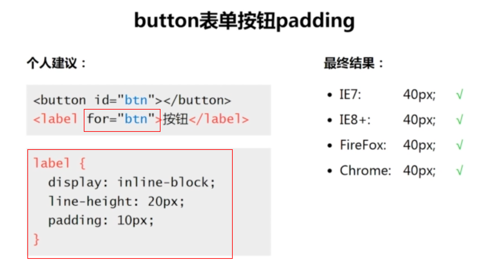

<h3>css之margin</h3>

<ul>
<li><strong>先理解占据尺寸和可视尺寸</strong>

包含margin虚线的部分为占据部分，包含border实线部分为可视部分

</li>
<li><strong>css改变盒模型尺寸</strong>

margin改变可视尺寸,可适用于没有设定width/height的普通block元素

<del>不适用于float元素，absolute/fixed元素,table-cell元素,</del>
<strong>只适用于水平方向尺寸(margin:设置正值和负值都有作用)</strong>
<pre>
.block2{
    background-color: blue;
    margin: 200px 100px;
}
</pre>

</li>
<li>

margin改变占据尺寸,可适用于block/inline-block元素都可以

与元素有没有设定width/height值无关

<strong>适用于水平和垂直方向尺寸(margin:设置正值和负值都有作用)</strong>
 
 
 
</li>
<li>
<strong>普通元素的百分比margin都是相对容器的宽度计算的</strong>
<pre>
.block3-in{
    width: 400px;
    height: 400px;
    margin: 10% 10%;
    background-color: blue;
}
</pre>

</li>
<li>
<strong>定位元素的百分比margin都是相对最近定位的祖先元素(relative/absolute/fixed)的宽度算的</strong>
<pre>
.block3-in{
    width: 400px;
    height: 400px;
    margin: 10% 10%;
    background-color: blue;
}
</pre>

</li>
<li><strong>父集与子集元素重叠的情况</strong> 

</li>
<strong>margin叠时的几种取值情况</strong> 
1,  
2,  
3, 
<li><strong>margin在左右布局的地步对齐可以派上用场</strong> 

</li>
<li><strong>margin在图文混排的时候</strong> 
    
</li>
</ul>

<h3>css之padding</h3>
<ul>
<li><strong>padding在box-sizing:border-box时 还是能改变元素的布局</strong> 
     
</li>
<li><strong>padding在以下的情况系会改变元素的布局</strong> 
     
</li>
<li><strong>关于form表单中的padding默认情况</strong> 
     
</li>
<li><strong>button在Firefox浏览器下的padding默认情况</strong> 
     
    <strong>button在IE浏览器下的padding默认情况</strong> 
     
    <strong>button在各个浏览器下的padding默认情况</strong> 
     
    <strong>button解决办法</strong> 
     
</li>
<li><strong>padding绘制简单的图标</strong> 
     
</li>
</ul>

