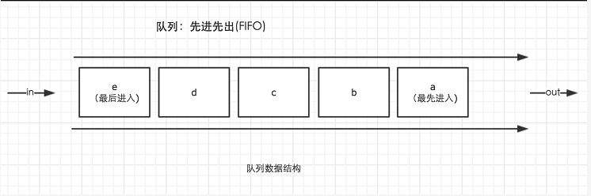
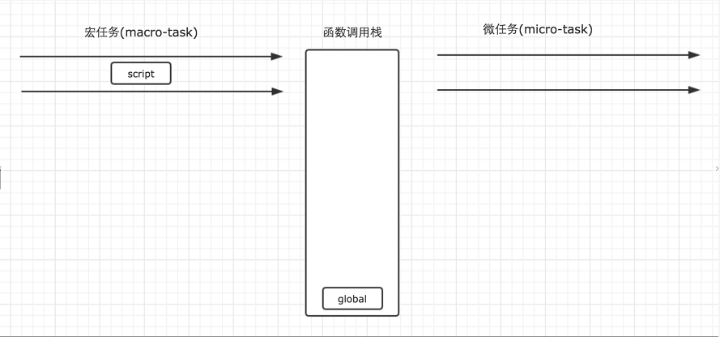
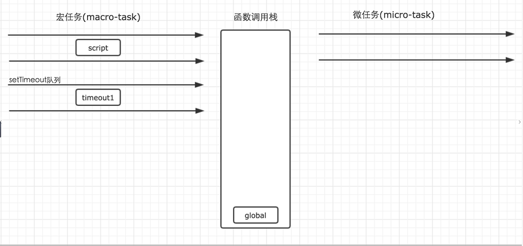
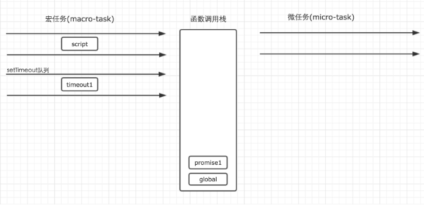
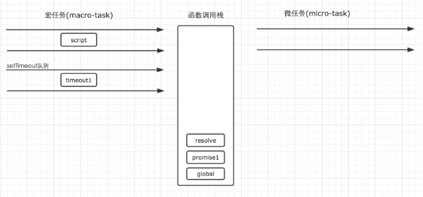
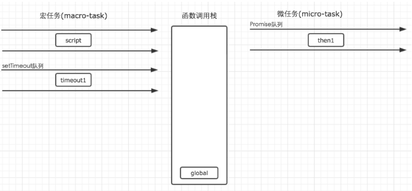
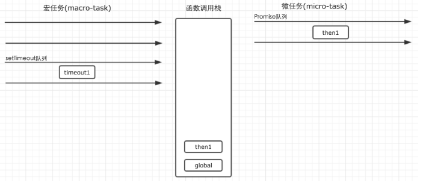
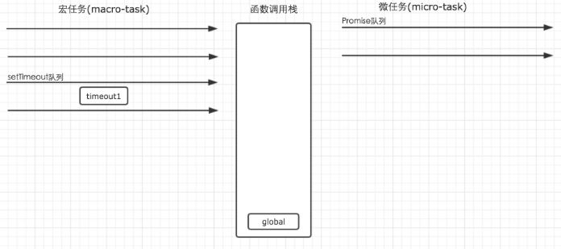
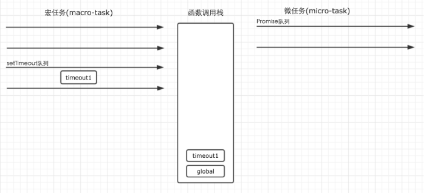

javascript事件循环机制
======
* 我们知道JavaScript的一大特点就是单线程(抛开web worker来讲)，而这个线程中拥有唯一的一个事件循环。
* javascript代码的执行过程，除了依靠函数调用栈来搞定函数的执行顺序，还依靠任务队列（task queue）来确定另外一些代码的执行。
   

* 一个线程中，事件循环是唯一的，但是任务队列可以拥有多个。

* 任务队列又分为macro-task（宏任务）与micro-task（微任务），在最新标准中，它们被分别称为task与jobs。

* macro-task大概包括：script(整体代码), setTimeout, setInterval, setImmediate, I/O, UI rendering。

* micro-task大概包括: process.nextTick, Promise, Object.observe(已废弃), MutationObserver(html5新特性)

* setTimeout/Promise等我们称之为任务源。而进入任务队列的是他们指定的具体执行任务。

* 来自不同任务源的任务会进入到不同的任务队列。其中setTimeout与setInterval是同源的。

* 事件循环的顺序，决定了JavaScript代码的执行顺序。它从script(整体代码)开始第一次循环。之后全局上下文进入函数调用栈。直到调用栈清空(只剩全局)，然后执行所有的micro-task。当所有可执行的micro-task执行完毕之后。循环再次从macro-task开始，找到其中一个任务队列执行完毕，然后再执行所有的micro-task，这样一直循环下去。

* 其中每一个任务的执行，无论是macro-task还是micro-task，都是借助函数调用栈来完成。

现在针对上面的叙述来进行讲解几个栗子

    //demo1
    

首先，事件循环从宏任务队列开始，这个时候，宏任务队列中，只有一个script(整体代码)任务。每一个任务的执行顺序，都依靠函数调用栈来搞定，而当遇到任务源时，
则会先分发任务到对应的队列中去，所以，上面例子的第一步执行如下图所示。
   

第二步：script任务执行时首先遇到了setTimeout，setTimeout为一个宏任务源，那么他的作用就是将任务分发到它对应的队列中。

    setTimeout(function() {
        console.log('timeout1');
    })

   

第三步：script执行时遇到Promise实例。Promise构造函数中的第一个参数，是在new的时候执行，因此不会进入任何其他的队列，而是直接在当前任务直接执行了，而后续的.then则会被分发到micro-task的Promise队列中去。

因此，构造函数执行时，里面的参数进入函数调用栈执行。for循环不会进入任何队列，因此代码会依次执行，所以这里的promise1和promise2会依次输出。
   
   
     
       

     
   

     
   构造函数执行完毕的过程中，resolve执行完毕出栈，promise2输出，promise1页出栈，then执行时，Promise任务then1进入对应队列

第四步：第一个宏任务script执行完毕之后，就开始执行所有的可执行的微任务。这个时候，微任务中，只有Promise队列中的一个任务then1，因此直接执行就行了，执行结果输出then1，当然，他的执行，也是进入函数调用栈中执行的。
      
    
 
 第五步：当所有的micro-tast执行完毕之后，表示第一轮的循环就结束了。这个时候就得开始第二轮的循环。第二轮循环仍然从宏任务macro-task开始。
    
     
  
 
 这个时候，我们发现宏任务中，只有在setTimeout队列中还要一个timeout1的任务等待执行。因此就直接执行即可。
 
    
     
  
 